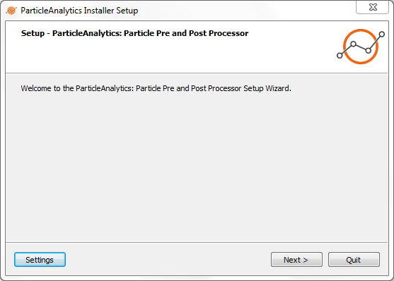
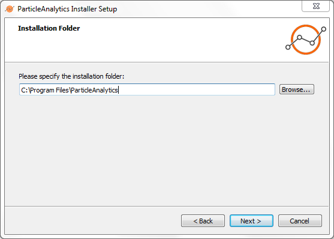
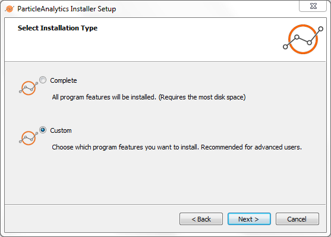
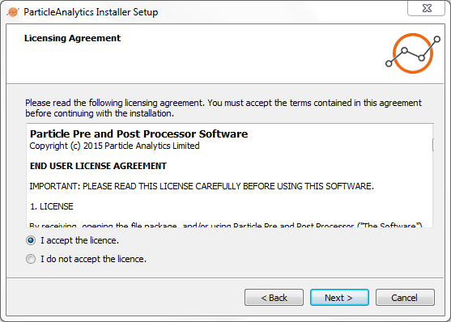
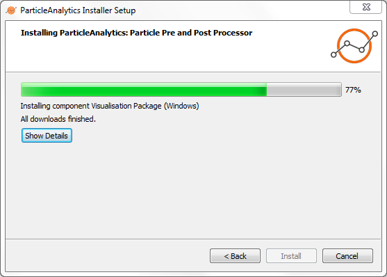
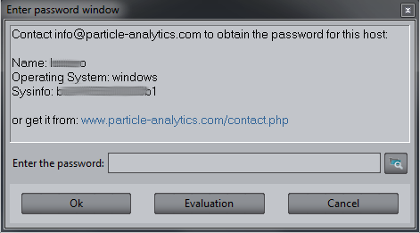

# Installation

This section explains how to install Particle-Analytics on a Linux or Windows system.  If installing for many users, administrator priviledges will be required.  If only installing for yourself, no such priviledges should be necessary.  You will need to be on a machine which is connected to the internet.

Begin by getting an installer executable from Particle Analytics.  If you do not already have this executable, contact _support@particle-analytics.com_ or visit [our website](www.particle-analytics.com/contact.php).

## Running the Installer

Once you run the installer, a window like this should appear ...

There should be no need to edit the _Settings_, simply hit _Next_ to get the next installer window ...

Here, you set the installation folder.  Those without administrator priviledges will need to chose a location which is appropriate to the priviledges that they do have.  Whilst the image above shows an x64 windows installer, a linux installer will chose a different (more appropriate) default installation location.

The next job is to decide whether you're are opting for a Complete or a Custom build.  This probably comes down to whether you want documentation, or not.  Installing documentation is recommended.

Accepting the _End User Licence Agreement_ is a necessary step if you with to continue with the installation.  You are encouraged to read this agreement before accepting.

The penultimate screen will show a progress bar as the different components install.  Once this is finished, simply hit _Finish_ on the final installer window.

## Your Licence

### Licensing from file

When you first run Particle-Analytics, a window like this should appear ...

Copy the _Name_, _Operating System_ and _Sysinfo_ data from that window and contact Particle Analytics ([support@particle-analytics.com](mailto:support@particle-analytics.com) with the information.  We will then give you a licence file specific to your machine.  Save this file in a location you can find again.

Next, 

 * Pull down the _Help > Register from file..._ option.   
 * Navigate to your licence file, select it, and open it

You should now have a fully functional system - please [contact Particle Analytics](mailto:support@particle-analytics.com) if you are having difficulties.

### Setting up a Particle-Analytics Licence Server

The following directions are broken into 2 parts.  The server-side instructions are for your system administrator, who is setting up your licence server.  The client-side instructions are for the end-user, or whoever is setting up their software on the client.

#### On The Server

 * Get the _**passerver**_ software from Particle Analytics
 * Install _**passerver**_ on your licence serving machine
 * Run the licence server daemon executable (_**passerverd**_) to start the licence server service
 * Run the configuration executable (_**passerver-conf**_).
   - An administrator will have to select/set a password, first time through, for future use.  

 * Inside _**passerver-conf**_ ...

   - A "green light" should be visible beside a `Stop server` button - your daemon has done its job.
   - Hit the `Add program...` button
     + A `Register Program` window will appear with a `Server sysinfo` field showing a string something like ...
                a0030600000000c1
     + Copy this sysinfo string and contact Particle Analytics (email: support@particle-analytics.com) about your floating licences - tell us your sysinfo string
     + Hit the `Cancel` button to leave program registration  

 * Particle Analytics will send you 2 text files; save these somewhere convenient

 * If _**passerverd**_ is not already running, start it up

 * If _**passerver-conf**_ is not already running, start it up

 * Inside _**passerver-conf**_ ...
   - A "green light" should be visible beside a `Stop server` button - your daemon has done its job
   - Hit the `Add program...` button
     + A `Register Program` window will appear with a `Server sysinfo` field showing a string something like ...
                a0030600000000c1
     + Hit the "file open" icon at the top left of the `Register Program` window
       * Select the FIRST of the 2 files you have been send by Particle Analytics.  It doesn't matter which one you call "first".
       * Your `Register Program` window should be full of fields containing meaningful, rather than blank, content
       * Hit the `OK` button
   - Hit the `Add program...` button
     + A `Register Program` window will appear with a `Server sysinfo` field showing a string something like ...
                a0030600000000c1
     + Hit the "file open" icon at the top left of the `Register Program` window
       * Select the SECOND of the 2 files you have been send by Particle Analytics
       * Your `Register Program` window should be full of fields containing meaningful, rather than blank, content
       * Hit the `OK` button  

 * Your licence server is now ready to serve licences to its clients

 * Note the IP address of your licence server, and the port number which you expect your client to use.
     
#### On Each Client

 * Run Particle Analytics
   - From the main menu chose `Help > Register Licence Server...`
     + A `Register Licence Server` window will open
     + Enter the IP address of the server, and the relevant port number, as supplied by your system administrator
     + Select the `Delete previous licences` option, if necessary.
     + Hit the `Register` button.  

 * Your software is now licensed and ready to use.  Please [contact Particle Analytics](mailto:support@particle-analytics.com) if you require any assistance.

