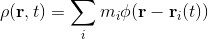
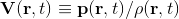
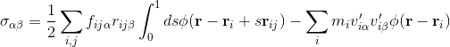

# Introduction

In most cases where [the Discrete Element Method (DEM)](https://en.wikipedia.org/wiki/Discrete_element_method) is used, it is necessary to carry out some averaging of the data to a scale more representative of what is required.
As such it is quite common for spatial averaging, temporal averaging, or both, to be applied to the DEM data.
To aid the process, a toolbox for the processing of DEM data both temporally and spatially has been implemented at Particle Analytics.
The toolbox has been developed to support many software packages (such as EDEM, PFC, DEMPack and LAMMPS) and provides a simple interface for the averaging
process for the large datasets that DEM simulations produce.

The toolbox provides both a coarse graining method for projecting the results onto a continuum field and a binning method.
Some of the results are shown in Figure 1.
The coarse-grained density _ρ_ is provided by equation:

where 

- **_r_** is a point in space where the values are to be evaluated, 
- _**r**i(t)_ is a vector to the centre of mass of the _ith_ particle at a given timestep _t_, 
- _mi_ is that particle's mass, and
- _φ_ is the coarse graining function which is subject to the condition of its integral over space being unity.

The coarse-grained velocity _**V**_ is provided from equation 

where _**p**_ is the coarse-grained momentum density.

The stress tensor is given by equation

where *fijα* is the interaction force between two particles, *rijβ* is the branch vector, *s* is the integral of the
branch vector and *v'* is the fluctuating velocity of the particle.

 and (c) are P-A results")
*Figure 1. Particle-Analytics toolbox in use - Post-processing on a fluidized bed. a) Particles visualization.
b) Spatial averaged density. c) Spatial and temporal averaged density over 20 sec.*
