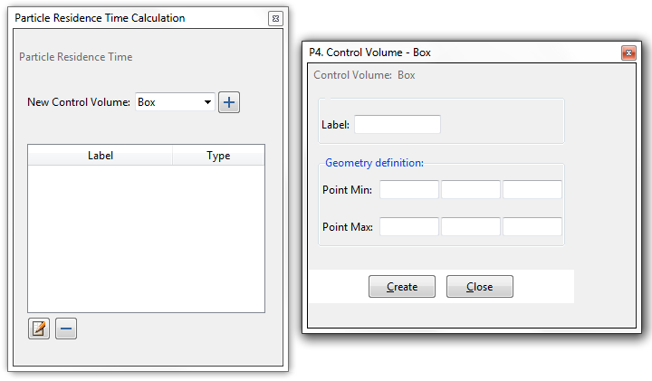
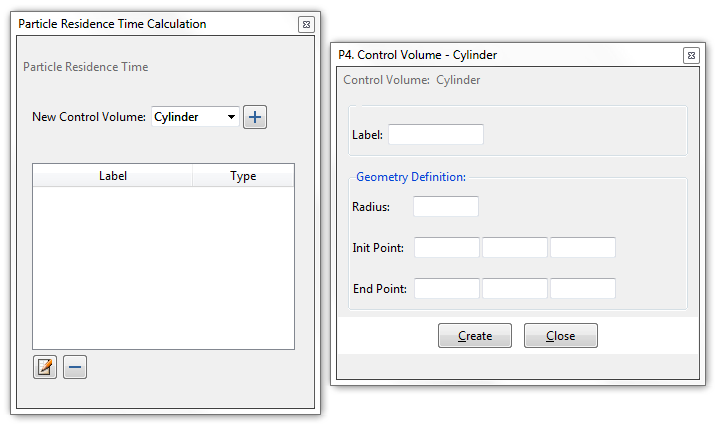
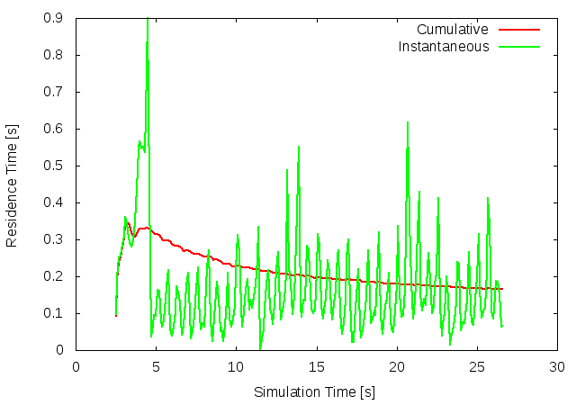

# Other Analysis

This option gives the user access to a number of analysis tools which are not found elsewhere in the user interface. 

Once clicked, the `Other Analysis` pull-down menu will appear, showing the different conversion options.  At the time of writing, only `Residence Time Calculation` is found here, but this will change soon. 

#### Residence Time Calculation

This will result in the calculation of the average amount of time that a particle spends in a particular region, or regions.  The results can be made into a graph showing how long particles are spending in different parts of the system, over the duration of the simulation.

##### Setup

Once selected, the user will see a `Particle Residence Time Calculation` window open, where they can define one or more regions (control volumes) across which the calculation will take place.  To define a cuboid control volume, select `Box` in the `New Control Volume` pull-down menu, and hit the `+` button:

To define a cylindrical control volume, select `Cylinder` in the `New Control Volume` pull-down menu, and hit the `+` button:

Each control volume should be assigned a `Label` - some unique string that has meaning to the user in the context of their experiment.  The importance of labels come when viewing the results.

Once created, a control volume will appear in a list in the `Particle Residence Time Calculation` window.  Once a volume's entry in the list has been selected, by left-clicking on it, the volume can either be removed by hitting the `-` button, or edited by hitting the `edit` button (which looks like a pencil writing on a sheet of paper).

##### Example

This graph shows how long particles are resident in a small cube at the bottom of a mixing drum.

The user generates such a graph via `Graph Load` on the [post-processing toolbar](post_postprocessing.md).  If `Residence Time Calculation` has been activated and one or more labelled control volumes created, then the user will see a number of variables available for graph creation.  Variables can be distinguished by their label (which will appear in the variable name) and whether they represent instantaneous residence time, cumulative residence time or a particle count.  More details on these quantities follow:

 * **Instantaneous Residence Time** : This is the average, per time-step, taken over the particles currently inside a control volume, of the time spent by those particles, in that control volume.  This will not account for any previous visits to the same volume by any of these particles.  

 * **Cumulative Residence Time** : This is the average, per time-step, taken over all particles which have thus-far spent *any* time inside a control volume, of the time spent by those particles, in that control volume.  

 * **Particle Count** : This records, per time-step, the number of particles currently inside a control volume.

 