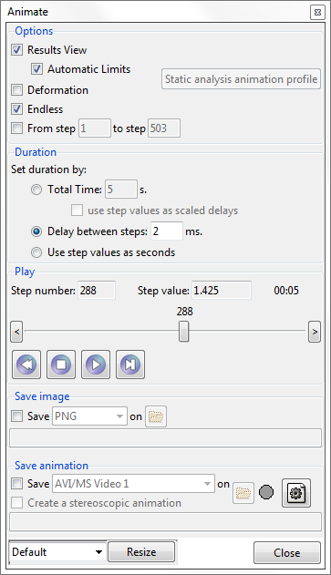

# Animations tool

One launches the `Result animation window` by clicking on the icon, shown above, on the post-processing toolbar.

This window lets you create an animation of the current Results View.  Key options include ...

 * **Automatic Limits** [on/off] : This determines whether each frame of the animation (i.e., each timestep) will get its minimum and maximum from the corresponding timestep (off) or from the set of all timesteps being used in the animation (on).  These limits define a range which affects the mapping from result component value, onto the colour used in the render.

 * **From step ... to step ...** : Used to focus the animation on an interesting part of the results.

 * **Save image** : Allows users to save the render of 1 timestep, as an image.

 * **Save animation** : Allows users to save the entire animation, as a video.