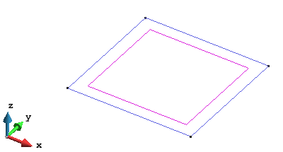
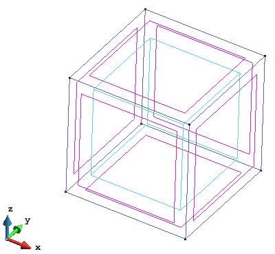
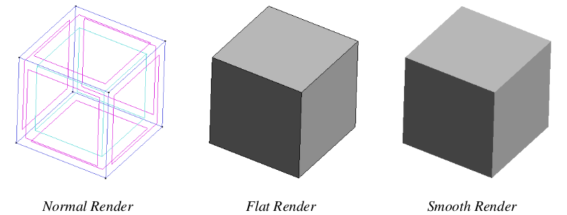
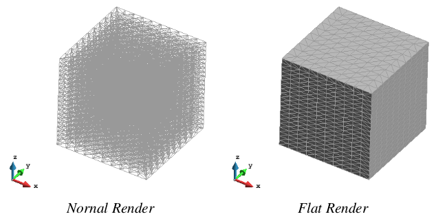
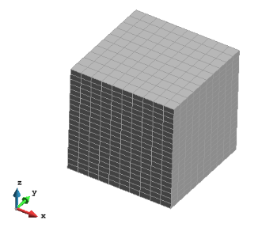

# Generating a model

Users can generate or import the geometry or mesh to be used during the analysis.

To import geometry or a mesh, different formats are accepted. The most common format for geometry are *IGES*, *PARASOLID* and *DXF*.
Further explanation of the import procedure can be found online, [in this tutorial](https://app.box.com/shared/static/qxaxvwbbnp09n0kx6520rj40mrikigyq.pdf).

To generate geometry from scratch, use the *Geometry & View* toolbar, found at the left edge of the window, or through the menu: `Geometry > Create`.

The detail of all available geometrical operations (generating, manipulating and deleting entities) can be found in:
`Help > Viz Manual... > PREPROCESSING > Geometry Menu`.

A useful command for simple cases is the generation of geometrical objects, where the most common objects can be created simply via:
`Geometry > Create > Object`.

Below, an example listing the required steps to generate a (2.0 x 2.0 x 2.0) cube is presented:

* Begin from the menu: `Geometry > Create > Object > Rectangle`
* First corner point: (In the `Command:` window) enter *0 0 0* and then hit the `RETURN` key
* Second corner point: Enter *2 2 0* and then hit the `RETURN` key. 
* Press `ESC` key to exit Rectangle generation.

* Next, extrude the square to generate a cubic volume: `Utilities > Copy...`.

* In the *Copy* window, select ...
  - *Entities type = Surfaces*, 
  - *Transformation = Translation*,
  - *Do Extrude = Volumes*,
  - *First point = (0.0 0.0 0.0)*, 
  - *Second point = (0.0 0.0 2.0)*.

* Press *Select* and use the mouse to drag-select your rectangle. 

* Press *Finish*

* To change the appearance of your cube explore the *Render* options (from the menu, `View > Render` or right click the mouse and chose *Render* from the resulting pull-down).

## Meshing the geometry

Once the geometry is created, it be discretized into unstructured, structured or semi-
structured mesh elements. The detail of all the meshing options can be found in `Help > Viz Manual... > PREPROCESSING > Mesh Menu`.

Using the previous cube example, one could generate a structured mesh of tetrahedral elements (with 10 elements in X and Y directions, and 20 elements in Z direction) as follows ...

* Opt for a structured mesh: `Mesh > Structured > Volumes > Assign number of cells`.

* With the mouse, drag-select your cube.  

* Hit the `ESC` key; a value-entry window will appear.  
  - Enter *10* and click *Assign*
  - Click one edge parallel to the X axis, and one edge parallel to the Y axis
  - (As each edge is clicked, you should see it and any parallel siblings change colour)

* Hit the `ESC` key; a value-entry window will appear.  
  - Enter *20* and click *Assign*
  - Click one edge parallel to the Z axis

* Hit the `ESC` key to exit structured mesh setup.  

* Generate the mesh from the menu using `Mesh > Generate mesh...`. 
  - Ignore the *element size* asked for in the *Mesh generation* window and click `OK`.

* Once the mesh is generated, click *View mesh* in the *progress* window which has popped up

* Change the render to *Flat* for a better visualization of the mesh.

* The tetrahedra is the default type of 3D element. To use Hexahedra (Prism is reserved for
semi-structured meshes), change the element type using: `Mesh > Element type > Hexahedra`,
and click over the volume to assign the type and `ESC` to finish. Now generate again: `Mesh > Generate mesh...`.

> Note:
> 
> * For processing with Particle-Analytics, structured or semi-structured meshes are recommended.
> * The element/cell size does **not** have any influence on the precision of the averaged values, and this is
only related to the resolution of the mesh (number of points) where the values are projected.
> *  As the resolution of the averaged values is only related to the number of points/nodes in
the mesh, it can be useful to use quadratic elements in the mesh, to minimize the number
of elements whilst maintaining the number of nodes. This decreases the output
file size and improves the visualization. To activate quadratic elements, use: `Mesh >
Quadratic type > Quadratic`.

