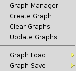
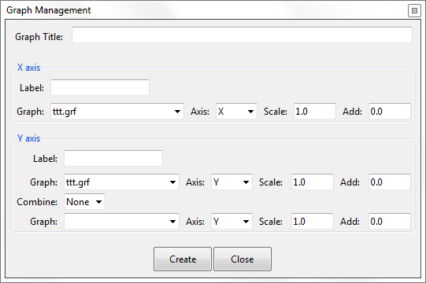

# Graph manager

  

This command displays a sub-menu to create/edit/save graphs.

#### Graph Manager

This opens the Graph Manager. This is equivalent to the `Window > View graphs...` menu option. 

More help on the graph Manager can be found in via the Menu : 

 * `Help > Viz Manual... > POSTPROCESSING > Window Menu > View graphs`

#### Create Graph

This opens the Graph Creation window. This command is used to create a new graph *which is a combination of existing graphs*.

  

#### Clear Graphs

This option clean the graphs buffer in GiD.

#### Update Graphs

Update the list of graphs in the menu.

#### Graph Load

Display the list of graphs available in the project to be loaded.

#### Graph Save

Display the list of graphs in the graph buffer (plotted in the graph window) and save the selected graph.