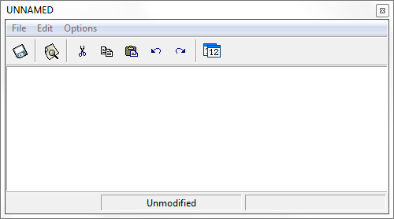

# Notes

This option allows the user to add notes related to the model. It is useful when working with large
models where much information is defined or when working with a set of models where just one
parameter (e.g., the material density or the time step) differs between models.

