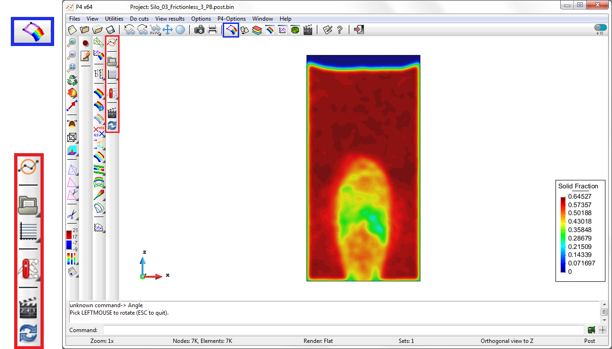

# After post-processing: Analysis

Once the user has some results to analyse, they can activate the post-processing toolbar using the pre/post toggle button, highlighted with a blue border, below:

*Figure. The Particle-Analytics Post-processing Toolbar and the Pre/Post Toggle Button*

The Post-processing toolbar is made up from the following ...

<table>
  <tr>
    <td></td>
    <td><b>Particle Analytics Documentation</b> </td>
  </tr>
  <tr>
    <td></td>
    <td><b>Load post-process File</b> : Show the list of result files available in the project. </td>
  </tr>
  <tr>
    <td></td>
    <td><b>Graph Manager</b> : Allows load/saving/manipulate of graph data. </td>
  </tr>
  <tr>
    <td></td>
    <td><b>Post-process Utilities</b> : List of available routines for manipulation and export results. </td>
  </tr>
  <tr>
    <td></td>
    <td><b>Animations</b>  </td>
  </tr>
  <tr>
    <td></td>
    <td><b>Change View Mode (Particles)</b> : Change the view mode/rendering for particles visualization. </td>
  </tr>
</table>

#### Contents:

* [Load post-process File](post_load_results.md)
* [Graph manager](post_graph_manager.md)
* [Toolbox for analytics](post_toolbox_analytics.md)
* [Animations](post_animations.md)
* [Change View Mode](post_view_modes.md)
* [Visualizing Particles](post_view_particles.md)
* [Visualizing Averaged Results](post_view_coarse_graining.md)

