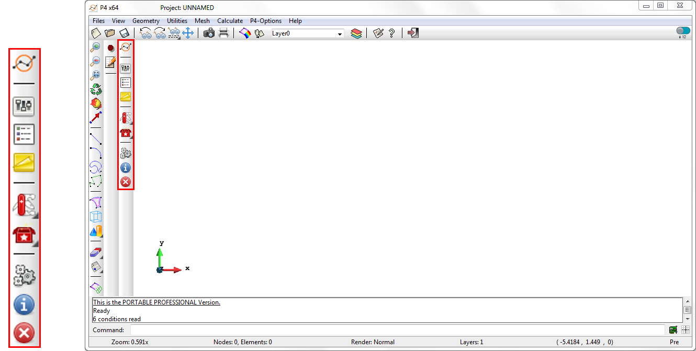

# Preparing post-processing

Upon start-up, the Particle-Analytics toolbar is available, as shown in Fig 2, below.

*Figure 2. Particle-Analytics Toolbar*

The description of the different commands in the toolbar is presented below:

|:-------:|:------|
|       | **Particle Analytics Documentation** : |
|  | **Post-Processing Settings** : Define input files and averaging method. |
|  | **Assign geometry/surface condition** : |
|     | **Project Notes** : |
|       | **Converter Toolbox** : |
|  | **Start Processing** : |
|  | **View Info** : Info for current process |
|  | **Stop Processing** : |

#### Contents:

* [Generating a model](post_generating_a_model.md)
* [Post-Processing Settings](post_processing_options.md)
* [Assign geometry/surface condition](post_assign_geo_and_conditions.md)
* [Project Notes](post_notes.md)
* [Converter Toolbox](post_toolbox.md)
* [Processing Control](post_processing_control.md)
