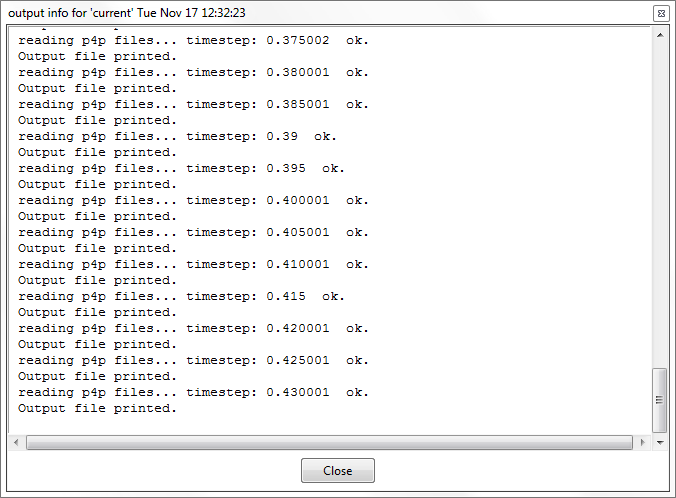

# Processing control

The process control within Particle-Analytics is defined by 3 main commands:

* () start processing
* () show info, and 
* () stop processing.

#### Start Processing

Initiate the processing of the simulation results. Check the settings and launch the process.

#### Show Info 

Shows a window with the evolution of the process, as shown below.

#### Stop Processing

Stop the execution. All the results generated thus far can be visualized in
the post-process.