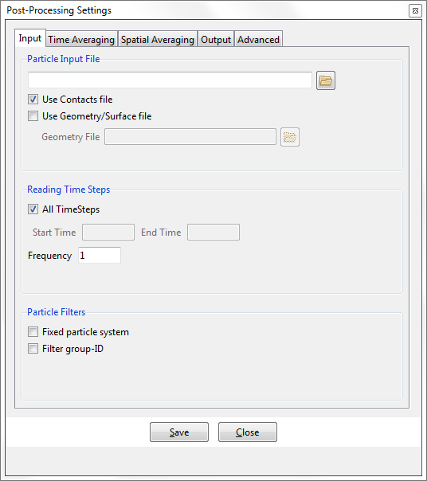

## Input

This section is used for the definition of the particles files to be processed. The files can be selected and filtered by time ranges, steps frequency and particle groups.

##### Particle Input File

* **Particle Input File** : This options allows the user to chose the input (.p3p/.p4p) file to be processed. In the case of the experimental [LIGGHTS](http://www.cfdem.com/liggghts-open-source-discrete-element-method-particle-simulation-code) dump file, the file extension expected is (.p).

* **Use Contacts file** : [on/off] This options activates the processing of particle-particle and particle-
geometry contact files if they are detected. Particle-Analytics assumes that contact files have the same name as the particles file, with extensions *.p3c* and *.p3w*, respectively.

* **Use Geometry/Surface file** : [on/off] This options activates in the inclusion of surface geometry.

* **Geometry File** : If using the Geometry/surface file, this field is where the file can be specified.

##### Reading Time Steps

* **All Time Steps** : [on/off] Used to activate the start/end time range (if `off`) and turn of the necessity for the range (if `on`). 

* **Start Time** : If `All Time Steps` is `off`, define the time at which Particle-Analytics should begin processing the input file.

* **End Time** : If `All Time Steps` is `off`, define the time at which Particle-Analytics should stop processing the the input file.

* **Steps Frequency** : Chose the frequency for reading the time steps from the input files.

##### Particle Filters

* **Fixed particle system** : [on/off] Define whether or not the number of particles and IDs are fixed for the duration of the simulation being analysed.

* **Filter group-ID** : [on/off] This option is used to indicate that a specific group ID of particles is to be processed.

* **Use Group-ID** : When `Filter group-ID` is activated, specify the group-ID of particles to be processed.
