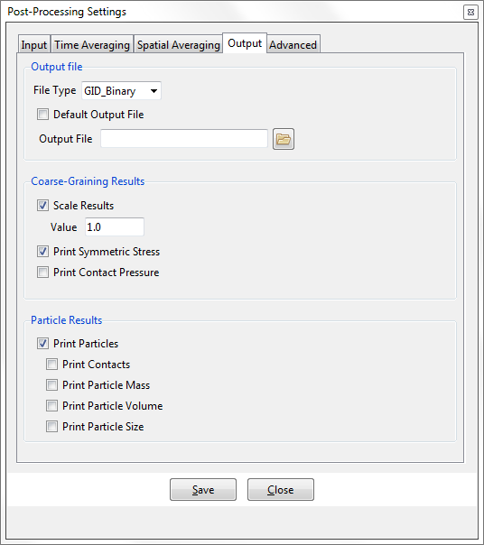

## Output

This section is used to define the output generation from Particle-Analytics. This tab enables the activation of the particles/contacts visualization files, exposes the output of special results, and allows the user to scale the results.

##### Output File

* **File Type** : [GiD\_Binary / GiD\_Ascii] Allows users to chose the type of output/post-process file written by Particle-Analytics.  The binary file reduces the file size, but since such files are not human-readable, no problems can be checked in such output. The Ascii file increases the file size, but is human readable in a text editor. Use the former, unless you have good cause not to.

* **Default Output File** : [on / off] Allows the user to use the default name for the output file (if `on`) or define a different one (if `off`).

* **Output File** : When `Default Output File` is `off`, define the file name for the output/post-process
file.

##### Coarse-Graining Results

* **Scale Results** : [on/off] Used to scale the results of Particle-Analytics. This option, combined with the spatial integrals, is useful when calculating the average in a certain direction or plane. The most common uses of the `Scale Results` option are:
 - A change of units in the model.

 - The calculation of the average value in a certain direction/plane. This is performed in combination with the 1D/2D integrals.

 - **Value** : When `Scale Results` is activated, define the scale value here.  

* **Print Symmetric Stress.** [on/off] Normally, the stress calculated in Particle-Analytics produces a non-symmetric tensor and all 9 components of the tensor will be written out. When this option is enabled, symmetry is enforced upon the stress tensor, and just 6 components are output.

* **Print Contact Pressure** : [on/off] This option is used to write the hydrostatic pressure of the contact stress tensor, as defined by 

##### Particle Results

* **Print Particles.** [on/off] Used to write an extra output file with the particles information. This is required to visualize the particles in the post-processor, but will result in an increase in processing time.

 - **Print Contacts** : [on/off] When activated, this ensures the contact information appears in the particles output file.

 - **Print Particle Mass** : [on/off] When activated, this ensures the particle mass appears in the particles output file.

 - **Print Particle Volume** : [on/off] When activated, this ensures the particle volume appears in the particles output file.

 - **Print Particle Size** : [on/off] When activated, this ensures the particle size appears in the particles output file. For spherical particles, this is the radius of the sphere.  For non-spherical particles, this is the radius of a sphere whose volume is identical to that of the particle.

