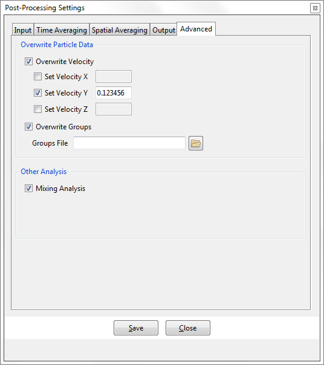

## Advanced

This section exposes the advanced features of Particle-Analytics, such as overwriting particle velocity.

##### Overwrite Particle Data

* **Overwrite Velocity** : [on/off] Allows the user to overwrite the velocity.

 - **Set Velocity [X,Y,Z]** : When `Overwrite Velocity` is activated (`on`) users can overwrite individual velocity components by first enabling the [on/off] radio button for a particular component, and then entering the relevant value in the corresponding window.

* **Overwrite Groups** : [on/off] Allows the user to overwrite the particles' group-IDs.

 - **Groups File** : If `Overwrite Groups` is enabled, define a file used to overwrite the particles' group-IDs in the particles file.

##### Other Analysis

* **Mixing Analysis** : [on/off]