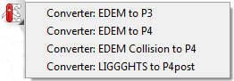
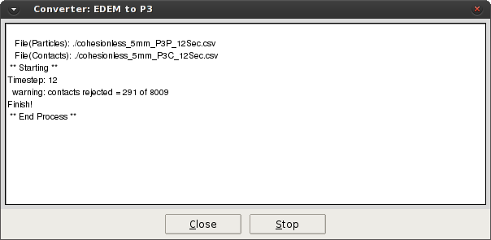
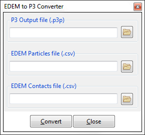
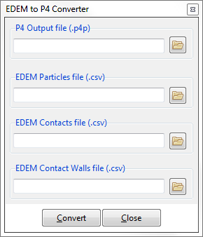
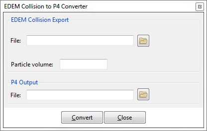
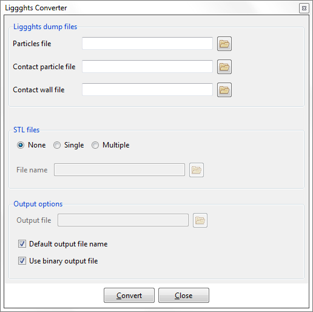

# Converter Toolbox

This option gives the user access to different pre-processing tools. Currently the toolbox is reserved for
converters from partner-exported files to Particle-Analytics file formats.

Once clicked, the Toolbox pull-down menu will appear, showing the different conversion options: 

#### Converter Essentials

Pressing the convert button will open the info window, which provides details of the conversion for each time-step as the files are being processed :

Once the files have been converted to the Particle-Analytics file format, the data can then be used with the Particle-Analytics Toolbox for advanced post-processing of the data. Calculation and post-processing of the data can only take place if [a mesh of nodes has been created within Particle-Analytics](post_generating_a_model.md)

> NOTE:
During the file conversion process, it is possible that some contacts will be rejected (as shown in image, above). However, only contacts that occur between virtual particles or virtual particles and geometry will be rejected. Virtual particles are generated where periodic boundaries are employed in the simulation and this is the only time contacts should be rejected.

The rest of this section covers the different converters, in turn ...

#### Converter: [EDEM](http://www.dem-solutions.com/software/edem-software/) to P3

See the next section for some specifics.

#### Converter: [EDEM](http://www.dem-solutions.com/software/edem-software/) to P4

The main difference between the "to P3" and "to P4" options is that only the latter can handle non-spherical particles in the simulation. The older (P3) format assumed spherical particles in the DEM
simulation, whilst the newer (P4) format does not.  Extra information is provided via the contact files, through the use of an API mechanism in [EDEM](http://www.dem-solutions.com/software/edem-software/).  

For more details, see [Using Particle-Analytics with EDEM](post_edem.md).

#### Converter: [EDEM](http://www.dem-solutions.com/software/edem-software/) Collision to P4

[EDEM](http://www.dem-solutions.com/software/edem-software/) can output collision information which can be visualized and processed within Particle-Analytics.  [EDEM](http://www.dem-solutions.com/software/edem-software/) users with such data can provide ...

* the data filename,
 
* the mean volume (or some other representative volume) of the particles used in the [EDEM](http://www.dem-solutions.com/software/edem-software/) simulation, and 

* the name of the *.p4p* file where they wish to store the converted data.  This Particle-Analytics file is a particle file; the collisions from [EDEM](http://www.dem-solutions.com/software/edem-software/) will be represented as particles within Particle-Analytics.

Once converted, this *.p4p* file can be loaded into Particle-Analytics.

#### Converter: [LIGGHTS](http://www.cfdem.com/liggghts-open-source-discrete-element-method-particle-simulation-code) to P4post

Users of [LIGGHTS](http://www.cfdem.com/liggghts-open-source-discrete-element-method-particle-simulation-code) who wish to visualize their data within Particle-Analytics, without any processing, can do so via this converter.  Filenames for Particles, particle-to-particle contacts, and particle-to-geometry contacts can be provided.  Additionally, geometry information can be provided.  Once converted into a Particle-Analytics *.particles* (or *.particles.bin*) file, the file can be loaded into Particle-Analytics in Post-processor mode and visualized in a number of ways.