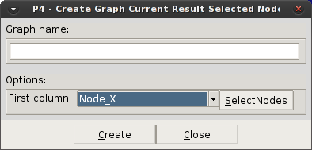

# Toolbox for analytics

This option displays post-processing utilities: the list of tools available for the export and manipulation of post-processing results.

  

#### Export current result

This option exports, in a plain text format, the result currently selected, for each node in the coarse-graining mesh, for the current timestep.

An example is shown below; both the  `Export Current Result` and `Result Exported` windows are shown - the latter appears once the `Export` button has been clicked :

  

The top lines of the resulting text file read as follows ...

<pre>
#Analysis  : TimeStep
#Step      : 0.61499999999999999
#Result    : Velocity
#Type      : Vector
#Components: |Velocity|
1 0.0032060358207672834  
2 0.0097971968352794647  
3 0.00053618056699633598  
4 0.0041011678986251354  
5 0.00039154148544184864  
8 6.1994112911634147e-05  
9 0.00031072593992576003  
10 0.00069418078055605292
</pre>
  

#### Export current result Nodes

This option exports in a plain text a chosen coordinate/ID and the selected result for a group of nodes in the mesh.

  

#### Average result Nodes

The option calculates the average value for the selected result in a user defined group of nodes.
The results shown are: Number of nodes for the average, the average value, and the standard deviation of the value.

#### Add legend

Display the Comment windows to visualize a legend with the present result.
(To see the detailed list of options available in GiD help: `Help > General Aspects > Utilities Menu > Tools > Comments > Postprocessing`)

#### Convert GiD particles to P3

The option write a Particle-Analytics file with the particle information using the Particle-Analytics format.
This is useful to process old simulations available in GiD post-process format.

  

#### Create Graph current result nodes

The option generate a graph with a defined group of nodes for the current result, over a chosen coordinate/node-ID.
Similar to *[Export current result nodes]*, but sending the information to the graph buffer without write a file.

  

#### Import result current timestep
