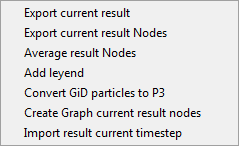
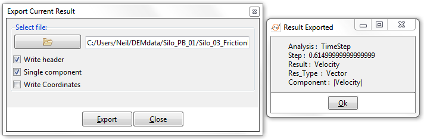
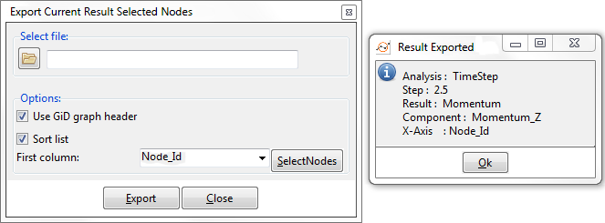
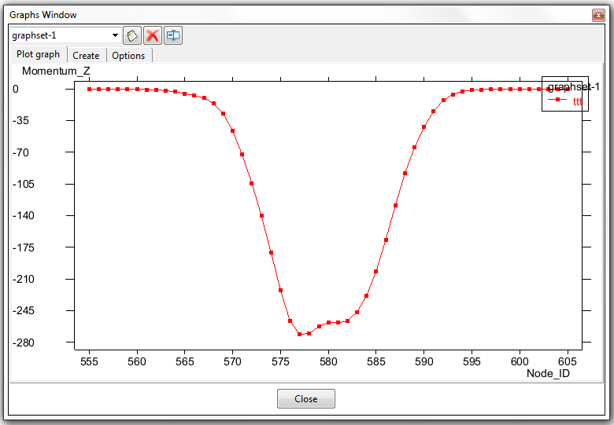
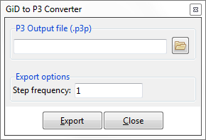

# Toolbox for analytics

This option displays post-processing utilities: the list of tools available for the export and manipulation of post-processing results.

  

#### Export current result

This option exports, in a plain text format, a chosen component of the result currently selected, for each node in the coarse-graining mesh, for the current timestep.  If Time-averaging is active, the export result will be the time-averaged result, rather than the result for a particular timestep.

An example is shown below; both the `Export Current Result` and `Result Exported` windows are shown - the latter appears once the `Export` button has been clicked :

  

The top lines of the resulting text file read as follows ...

<pre>
#Analysis  : TimeStep
#Step      : 0.61499999999999999
#Result    : Velocity
#Type      : Vector
#Components: |Velocity|
1 0.0032060358207672834  
2 0.0097971968352794647  
3 0.00053618056699633598  
4 0.0041011678986251354  
5 0.00039154148544184864  
8 6.1994112911634147e-05  
9 0.00031072593992576003  
10 0.00069418078055605292
</pre>

The `Results Exported` window and the contents of the file tell me that this data is for time-step 0.615, concerning the velocity field (which is a vector) and in particular (rather than it's X, Y or Z component) it's modulus.

#### Export current result Nodes

This is like the previous option, `Export Current Result` only for a selection of coarse-graining nodes, rather than all the nodes in the mesh.  It exports in a plain text format the current result, for a specific selection of nodes, and pairs each result-component with either that Node's ID, or one of its X,Y or Z positional coordinates.  In this way a graph can be created when the value of the result-component is mapped against (say) the nodes' IDs.

To select some node click the `SelectNodes` button and either click on several nodes or drag-select several nodes.  Either way, end selection by hitting the `ESC` key.  Now hit the `Export` button.

An example is shown below; both the `Export Current Result Selected Nodes` and `Result Exported` windows are shown - the latter appears once the `Export` button has been clicked :

  

Your graph has now been created.  Or your plain text file has been created, if you did not opt for `Use GiD graph header`.  Assuming you have a graph, go to the graph manager on the [post-processing toolbar](post_postprocessing.md) and select `Update Graphs` to get your newly-created graph into your project.  Now select `Graph Load` and pick your new graph - you should see something like the following:

  

Note there is an advantage here over a graph which slices through the data at (say) a particular Z value.  In the slice scenario, when the slice passes between coarse-graining nodes, cutting some edge in the coarse-graining mesh, the value you see in your graph is an interpolated value got from the coarse-graining nodes at either end of the edge - so you introduce an extra level of interpolation.  With the method described here, no such extra interpolation is involved - the values come directly from the nodes.

#### Average result Nodes

This option follows a similar path to the previous option, `Export Current Result Nodes`, in that having chosen it, the user must select several nodes exactly as described above.  Upon exiting node-selection, by hitting the `ESC` key, Particle-Analytics calculates the average value for the current result-component, over that group of nodes.

The results appear in a pop-up window and consist of: 

 * Number of nodes selected, 
 * the average value of the current result-component over those nodes, and 
 * the standard deviation of the same.

#### Add legend

Display the Comments window to visualize a legend with the present result.  See:

* `Help > Viz Manual... > GENERAL ASPECTS > Utilities Menu > Tools > Comments > Postprocessing` 

for more information.

#### Convert GiD particles to P3

The option here is to write out a Particle-Analytics file containing particle information got from old simulations loaded in the GiD post-process format.

  

#### Create Graph current result nodes

This does exactly what `Export current result Nodes` does, only there is no plain text option - a graph is always what you get.  The other difference is that the graph exists in the project without having first to save it to a file.

#### Import result current timestep

Users who have data from outwith their DEM project (perhaps data from a CFD solution) can pull that data into Particle-Analytics here, to visualize it in the post-processor, or combine it with results from their DEM solution to create new results which are a combination of the two.

Optionally, upon loading, the data can be manipulated as follows ...

 * First, (if the `Abs()` radio button is `on`) take it's absolute value. 
 * Next, (if the `Scale` radio button is `on`) scale the value from the first step using the user-provided scale factor, and
 * Finally, (if the `Add` radio button is `on`) increment the value from the second step using the user-provided increment.

Using any combination of the above (including none) is valid.
