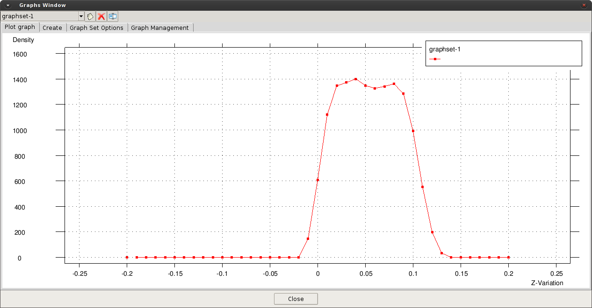

# Visualizing averaged results

After the model is processed and the Particle-Analytics output files are generated, a number of visualization and results-analysis tools can be brought into play.

One can load the coarse-graining mesh via the [*Load post-process file* section](post_load_results.md) of the [Post-processing Toolbar](post_postprocessing.md).

Once the file is loaded, the different meshes used in the process will appear in the [`Select & Display Style` window](post_view_particles.md).

To visualize the averaged results, open the `View Results and Deformation` window (`Windows > View results...` or `CTRL-d`).

The figure below, which uses the same solution that dominates [the previous section](post_view_particles.md), depicts the density projected first onto a volumetric mesh of tetrahedra, and then onto a planar mesh of triangles which slices through the middle of the domain.

The interior of the volumetric mesh can be visualized through slicing planes defined over different directions:

* See the `Cut Plane > Succession` section of `Help > Viz Manual... > POSTPROCESSING > Do Cuts Menu` for more help on defining your cut planes.  The basics are described below ...

* First find the `Cut Plane > Succession` button on the `Geometry and View Toolbar`; its icon is a pair of scissors, and the icon for the sub-button you want is 4 pairs of scissors.

* Define the cutting axis by two points. Enter first point: *(0.0 -0.2 0.0)*, and second point: *(0.0 0.2 0.0)*.

  - *If you don't know which points to chose, `Utilities > Id` on the main menu is useful - click on some node at (say) the extreme left edge of your mesh and it will tell you its ID and coordinates, then do the same at the right edge and you've got the 2 points for defining slices which go left to right*  

* Enter the number of cut surfaces along the defined line: 4 (for example, has been used here). Each cut surface will appear as a different layer in the [`Select & Display Style` window](post_view_particles.md), and can be visualized by deactivating the volume mesh, therein.  You might want to adjust their `Style`, too (see the `St` column).

  

* Reactivating the volumetric mesh and deactivating the cuts (in the [`Select & Display Style` window](post_view_particles.md)), it is possible generate new cuts in a different direction ...

* Selecting a new set of successions in direction Z (First point: *(0.0 0.0 -0.2)*, second point: *(0.0 0.0 0.2)*, and 4 cut surfaces) gives ...

  

## Graphs

To analyse the results in the mesh, graphs can be generated for the temporal evolution of a variable at a
defined point or for the spatial distribution of a chosen variable.  Each is outlined, below:

##### Temporal

The generation of a graph, showing the temporal evolution of a variable at a predefined point, is described below :

* Go to the main menu and open : `View results > Graphs > Point evolution > Density`

* Enter the coordinates of the point: *(0.3 0.0 0.05)*. More points can be entered or `ESC` to finish.

  

##### Spatial

In a similar way, the spatial distribution of a variable in a defined direction can be plotted:

* Set the spatial direction as X axis: `View results > Graphs > Line graph > Set X axis > Z variation`.

* Set the variable to plot: `View results > Graphs > Line graph > Density`.

* Enter the initial point of the plot: *(0.3 0.0 -0.2)*, and the second point: *(0.3 0.0 0.2)*. More points can be entered or `ESC` to finish

  

The graphs can be modified using the options in the Graph window, or one can export them (as 2 column ASCII files: `Menu > File > Export > Graph`) for something like *Excel* or *Matlab* to render.

## Pressure/drag force in surfaces

When the user defines physical surfaces (geometries), pressure and drag forces over those surfaces
can be calculated during processing.

Sticking with the above example, if the condition is applied to the surface in the middle of the domain (the
conveyor), the drag forces and pressure will appear in the results menu. In the figure below, the resultant
drag force in X and Z directions are depicted.

## Integrals

The calculation of integrals in a particular direction (1D) or plane (2D) can be especially useful in certain
situations, such as the calculation of mass or volumetric flow rate.

Another case in which the integral can be used is the calculation of the average values in a certain direction when the results should be uniformly distributed. For this, the averaged results can be projected over a surface, decreasing the amount of information required.

With the previous example, the average density over the Y direction, *<ρ>y*, is calculated as follows:

* Activate the integral : In the [`Spatial Averaging` tab of the `Post-Processing Settings` button, on the `Particle-Analytics` Toolbar](post_processing_options_frame3.md) set `Spatial Integral` to *1D*, and `Integral Direction 1D` to *Y*.

* In the [`Output` tab](post_processing_options_frame4.md) turn `Scale Results` *on* and set the scale `Value` to *1/L* (where *L* is the length in Y direction).

* Generate a geometry (surface) over the plane XZ, considering the dimensions of the domain (the
position of the surface in the Y direction is not relevant and any value can be used).

The results of the simulation are ...

