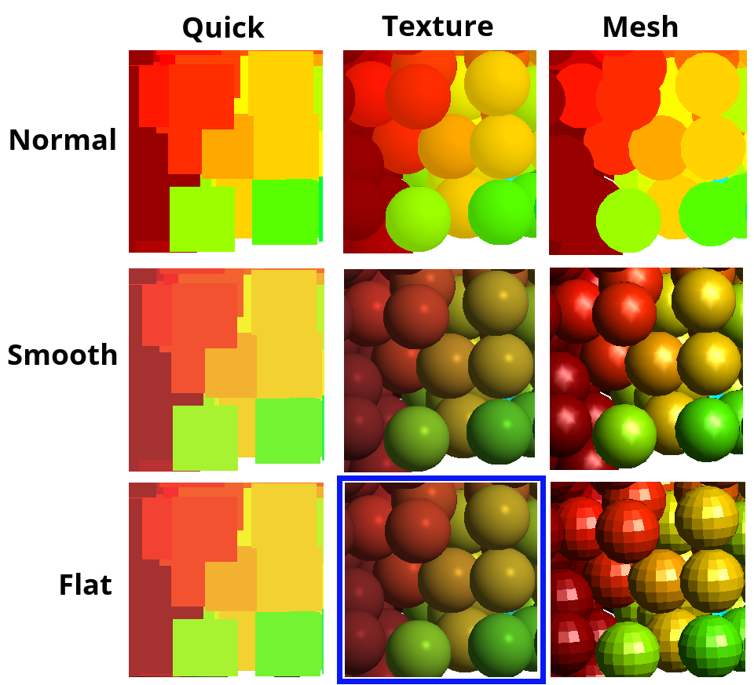

# Change View Mode (Particles)

For use when visualizing particles, rather than the coarse-graining mesh.

One changes the view mode by clicking on the `Change View Mode` icon, shown above, on the post-processing toolbar.  

The Three View modes are `Quick`, `Texture` and `Mesh`, described below:

* **Quick** : The particle is represented by a square, facing the viewer, centred at the centre of the particle, just large enough to contain the projection of the particle, in the direction of the viewer.

* **Texture** : An internal depth texture is used on the square from `Quick` to give a fast but realistic render of the particle

* **Mesh** : Use a mesh of triangles to represent each particle.  By far the slowest method, but perhaps the most "correct"

Additionally, one can change the `Render Status` by clicking on the word `Render` at the bottom of the window (or under right-click/Render...) - the three modes are :

* **Normal** : A cheap and fast render method

* **Flat** : Illumination is per element, not per pixel

* **Smooth** : Illumination at each pixel is got by interpolating the illumination across an element, having evaluated it at each of the element's vertices

The resulting grid of possible renders is shown below ... the default method (Texture and Flat) is shown highlighted by a blue box.  Users are encouraged to use this default method, unless they find good reason to change.

