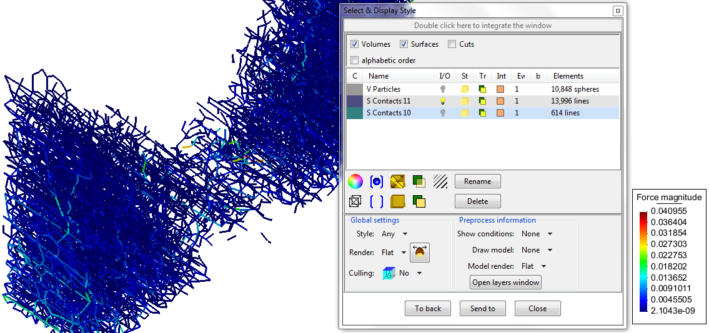
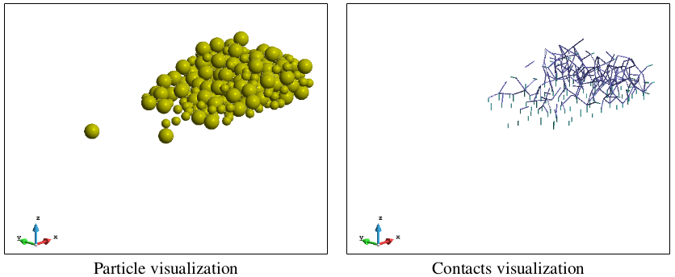
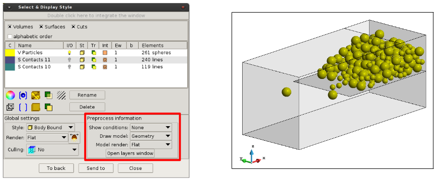
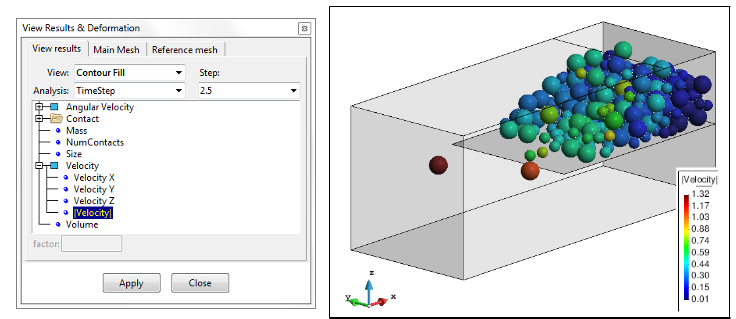
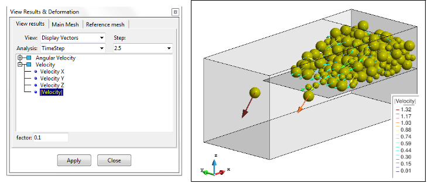
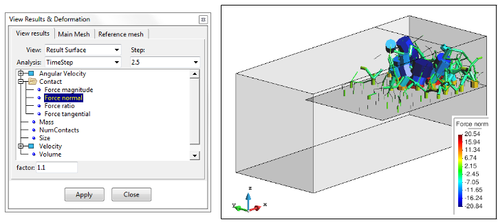

# Visualizing particles

Having previously activated *Print Particles* in the `Output` tab of the [Post-Processing Settings](post_processing_options_frame4.md) and performed processing via the [Start Processing](post_processing_control.md) button of the [Particle-Analytics Toolbar](post_preprocessing.md), the user can load the particles via the [*Load post-process file* section](post_load_results.md) of the [Post-processing Toolbar](post_postprocessing.md).

The files containing the particles, and optionally the contacts, have the extension _.particles_ after the user-defined name (and perhaps _.bin_, after that, if they're binary files).  It is these files that are considered, here.

By default, the [*Texture* view mode](post_view_modes.md) is activated and both particles and contacts are
rendered. 

The control over whether a group of contacts/particles is rendered, and how they are rendered (as lines, as surfaces, as a combination of both, with(out) transparency, etc) is via the `View style` button (shown above), which opens the `Settings & Display Style` window.  In the example below, the toggles in the `I/O` column of the `Settings & Display Style` window have been set so that only particle-to-particle contacts are rendered :

The particles file just contains information on particles and contacts; no information of geometry
is stored.  Here we see the contrast between just rendering the particles, and just rendering the particle-to-particle contacts :

If the geometry or mesh is required in the visualization of the particles/contacts, the option *Draw model* in `Preprocess information` section of the `Settings & Display Style` window can be set to something other than `None`.  One must have first loaded the geometry/mesh in the pre-processor. Whether the geometry appears at all, or is opaque, or transparent, can be controlled via the `Layers and groups` window, which is opened by hitting the *Open layers window* button, in `Preprocess information` section of the `Settings & Display Style` window.  Here, the geometry has been set to transparent :

To visualize the particle results, and to control the specifics of that visualization, open the `View Results and Deformation` window (`Windows > View results...` or `CTRL-d`).  In the following two examples, the same result (magnitude of the particle velocity) is rendered in two different ways: First, the fast particles are coloured *hotter*, whilst the slower are *cooler* ... and ... Second, the particles are rendered with orientated arrows, whose colour and size and direction is got from the velocity result.

The visualization of the *Force Chain* within the particle contacts can be visualized by setting the `View` field of the `View Results and Deformation` window to *Result Surface*.  Please be sure that the contacts are activated for visualization and the particles are deactivated or are transparent.

For more details about the visualization options and capabilities, see: `Help > Viz Manual... > POSTPROCESSING > View Results Menu`