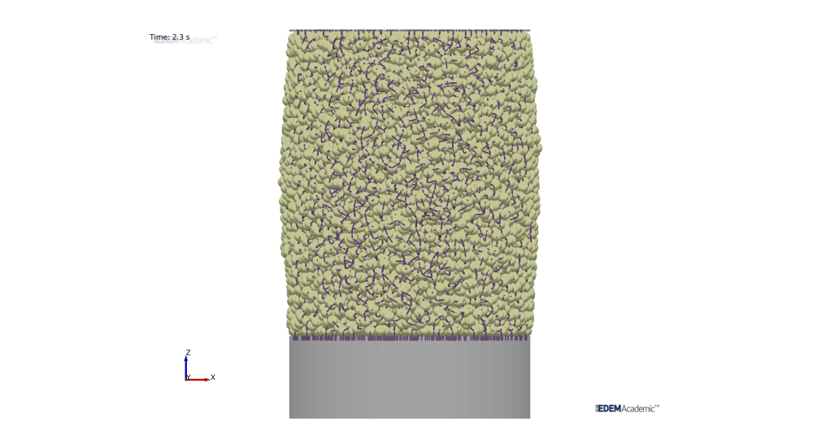
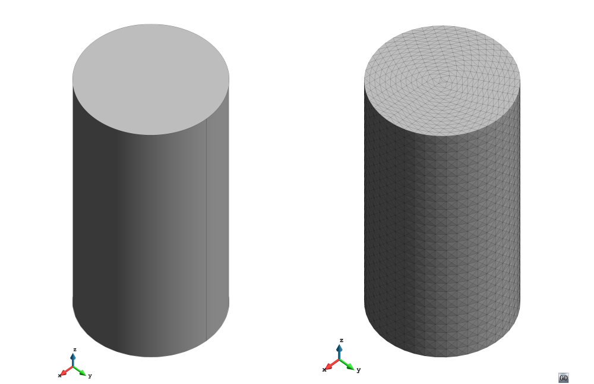
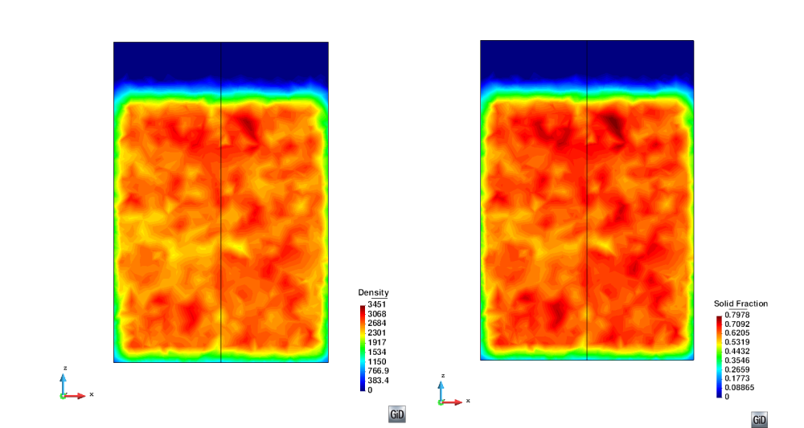
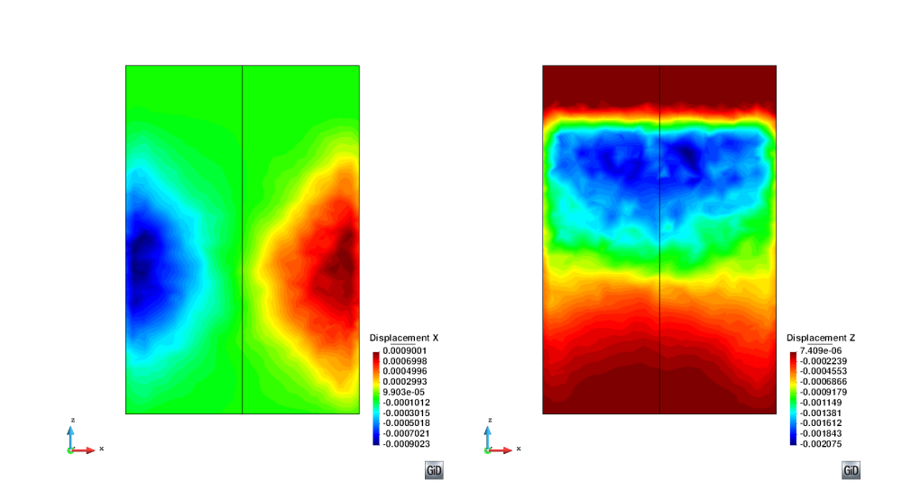
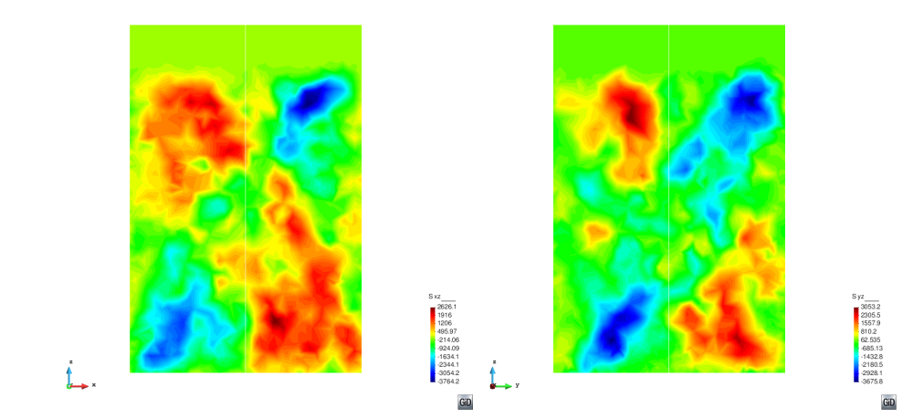
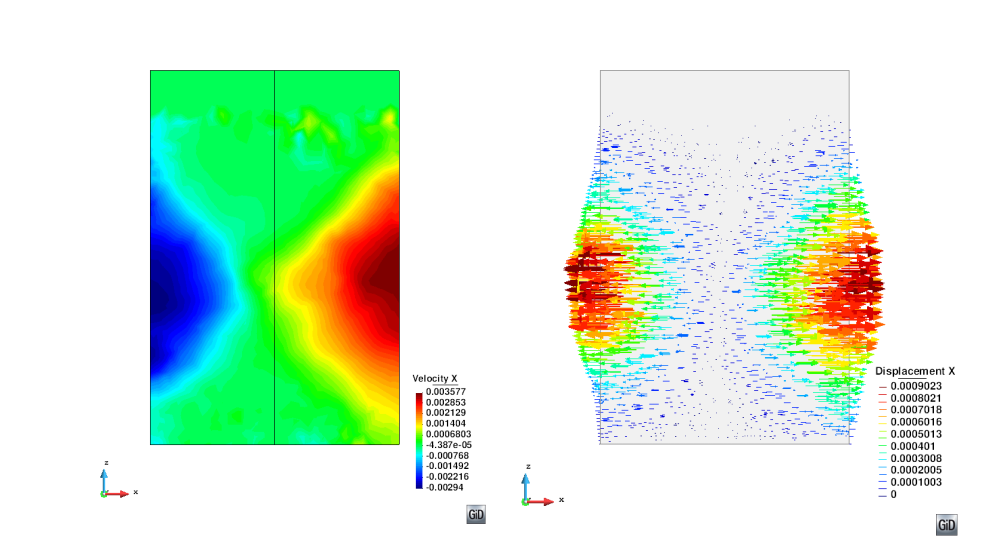

#Tutorial 3: Uniaxial Compression Test

*Author: John Paul Morrisey*

##Introduction

The flow behaviour and handling characteristics of cohesive granular solids are strongly
dependent on the prior consolidation stress experienced by the solid. This can be
assessed by test methods such as shear tester or uniaxial testers. The following tutorial
describes the use of P4 to analyse a DEM simulation of a uniaxial tester to measure
properties such as density, packing fraction and stress and to search for phenomena
such as local shear bands.

*Figure 1: DEM model of uniaxial test - From left to right: a) filling, b) loading, c)
unloading, and d) unconfined compression.*

**Problem Description**
The following section introduces a simple problem where a DEM Model (Figure 1) of
equal dimensions to the Edinburgh Powder Tester (EPT) which is a semi-automated
uniaxial tester. It has been created and simulated within the EDEM simulation software.
The three main stages of the experiments are shown from the simulation in
Figure 1 and include the filling of sample, the confined compression and the unloading
and unconfined compression to failure of a sample. The failed assembly of particles
following unconfined compression is shown in Figure 2.

*Figure 2: End of unconfined uniaxial test - Failed assembly of particles*

The DEM simulations were carried out using EDEM with a sampling frequency of 1000
Hz. Section 2 gives the salient simulation parameters including particle size, density
and domain size. The following example shows the processed results for the unconfined
compression only, although the same mesh can be used for both confined and unconfined
phases of the simulation.

| Particle info                 |  Value    |
|:------------------------------|:----------|
| Number of Particles           | 10000     |
| Diameter, [mm]                | 1         |
| Sphericity                    | 1.5       |
| Particle Density, ρ [kg/m 3]  | 4350      |
| **Geometry**                  | **Value** |
| Cylinder height [m]           | 0.08      |
| Cylinder radius [m]           | 0.02      |

*Table 1: Simulation parameters for DEM uniaxial test*

##Preparing analysis

###Geometry

The simulation domain is recreated in GiD by creating a circular geometry as the base
with a radius slightly larger than the cylinder (to account for sample expansion in the
unconfined test) with it’s normal in the z direction.

Create a circle by `Geometry > Object > Circle` and enter the centre point of the
cylinder base `(0.0 0.0 0.0)`. Once the centre is entered the normal direction is defined
in the pop-up box - in this case it is the “Positive Z ”direction. The zoom frame option
can be used to improve visibility and focus on the geometry.

### Mesh Generation

As the uniaxial test specimen is cylindrical, a centre structured mesh is best suited.
This mesh is applied from the meshing menu `Mesh > Structured > Surfaces > Center Structured`.
Set the number of concentric division (in this case 15 division or rings are
used fo creating the mesh - this leads to 45 perimetral divisions) assign to select the
geometry and finish to apply settings to that geometry. Equal sized division are used
and no bias is selected for the mesh (Both Concentric element distribution options are
set to 0.0)

*Figure 3: Initial Pre-processing - Cylinder before and after meshing. Left) Geometry; Right) Structured mesh for post-processing.*

Next extrude the cylinder base to form the 3D volume to be used for the mesh: Extrude this in z direction by `Utilities > Copy`.
From the toolbox select:

- Entities Type: Surfaces
- Transformation: Translation
- First point `(0.0 0.0 0.0)` and second point `(0.0 0.0 0.08)`.
- Do extrude Volumes
- Select

Once the 3D volume is created, the size of the mesh elements in the vertical direction
is applied to the mesh by `Mesh > Structured > Volumes > Assign size` setting the
element size to 0.003 (in this case approximately 26 in the vertical direction).
Select the line to assigner the properties to (the vertical edge of the cylinder) and press escape to proceed.

Default mesh elements of tetrahedra are used and the mesh is generated using:
`Mesh > Genereate Mesh (or Ctrl-g) > OK > View Mesh`.
This should look like Figure 3b

##Analysis settings

Standard P4 export files are generated for EDEM for both particle and contact data.
Additional Angular Velocity Queries (X,Y,Z) are included for the Particles data file.
Files are converted from the standard EDEM .csv to the P4 format using the EDEM-P4
converter as described in Appendix A.

Clicking on the CG preferences button (just below P4 symbol) will
open the settings toolbox which comprises of 4 sub toolboxes: Main, Input, CG and
Input.

**Input**

- `PARTICLES FILENAME` : Browse to the destination of the converted P3/P4 files and select.
- Process Contacts File option is checked to allow stress calculations
- `READING TIME STEPS` : A time range of `ALL` is selected with a step frequency of 1.
- `PARTICLE FILTERS` : Fixed Particle System option is checked. Using this option allows the cumulative displacement of particles top be calculated from the initial position of the particles in the analysis.

**Time Averaging**

- Activate Time Averaging is checked.
- `TIME AVERAGE` is set to `FREQUENCY`.
- `TIMESTEP FREQUENCY` is set to 10.

**Spatial Averaging**

- `TYPE` : Coarse graining is employed in this example.
- `FUNCTION TYPE` : Heaviside.
- `CUTOFF` : 0.005.
- `SPATIAL INTEGRAL` : No.

**Output**

- `GID ASCII` is chosen in this particular example - File can also be read outside GiD.
- `OUTPUT FILE` : OTHER.
- `OUTPUT FILENAME` : A specific file name chosen.
- `PRINT PARTICLES` option is checked to visualise particles.

Press the `ACCEPT` button to store the setting for analysis. Start process with the start
process button in the P4 toolbar and allow data files to be processed by P4.
Progress can be viewed by selecting the view run info button.

##Visualizing results

Once processing is complete click on the post process option in the GiD toolbar and
load the saved *.post.bin file from the post processing tool box. Data will now be
loaded for analysis and visualisation. Results can be visualized by: Go to `View Results > Smooth Contour Fill > Required Item`.

The data will be initially projected on the outside of the mesh when loaded as in Figure 4a.
To view the results at the centre of the assembly cut planes are introduced.
Two orthogonal planes are used in this example.

*Figure 4: Meshed geometry and cut planes with results. Left) Processed Assembly; Right) Cut Assembly*

To create these planes first switch the view to the xy plane using the List of views option
in the GiD toolbar and select View XY Plane (Original). Next is to create the two cut
planes and this is accomplished by using the 2 Point cut plane tool `Do Cuts > Cut Plane > 2 Point`
and defining the two points that are used for the cut plane.
In this case the first plane is defined by `(-0.025,0)` and `(0.025,0)` and a line will appear across
the circular plan of the assembly.
Repeat for the perpendicular plane with coordinates of `(0,-0.025)` and `(0,0.025)`.

The outer mesh surface can be switched of using the layer manager and toggling
the layer visibility (lightbulb icon). The cut planes should appears similar to Figure 4b.

Further Results can then be visualized for each plane by:
`View Results > Smooth Contour Fill > Solid Fraction, Density, Stress, Displacement or Velocity` as required.
This will provide time averaged smooth contour plots like in Figures 5 and 8.

Figure 5 shows how the packing of the assembly in terms of both the bulk density and
packing fraction. Areas of high solid fraction lead to higher bulk densities.

*Figure 5: Results on Plane XZ - For assessing the packing of the assembly. Left) Density; Right) Solid fraction.*

As the assembly contained a fixed number of particles it is possible to recover the
cumulative displacements (Figure 6) starting from the first timestep of the processed
data file.

*Figure 6: Results on Plane XZ - Cumulative displacements. Left) Displacement X; Right) Displacement Z.*

*Figure 7: Shear Stresses - For assessing the failure mode of the assembly. Left) Shear Stress on Plane XZ; Right) Shear Stress on Plane YZ.*

Combining the information from both the particle velocities (Figure 8a), shear stresses
(Figure 7) and cumulative displacements (Figure 6), it is possible to visualise how the
assembly of particles is failing and determine the failure mode - in this case there is
shear failure with conjugate shear bands. This is better displayed in Figure 8b where the
displacements vectors are plotted to give a representation of the final failed state.

*Figure 8: Results on Plane XZ - Assessing the failure mode. Left) Velocity in horizontal direction; Right) Displacement vectors*

It is also possible to plot graphs of the different results. Figure 9 plots the evolution
of the vertical stress (Szz) in the assembly at several different heights for the duration
of the processed data. This can be used to determine the unconfined yield strength of
the sample which will be the peak value, which in this case is approximately 15 kPa at
2.03 sec. The method for plotting the point graph is:

- `View Results > Graphs > Point evolution > Stress > Szz`
- Input the coordinate of interest through the command window or by selecting the node on the mesh.
- This generates a graph of stress against time for the selected node.
- Repeat for as many locations as required for the point evolution against time.

*Figure 9: End of unconfined uniaxial test - Failed assembly of particles following unconfined compression*

Figure 10 shows how the density variation observed in Figure 5a can be plotted at
different timesteps for comparison. The graph also shows a relatively uniform density
distribution which does not vary significantly with time during the unconfined com-
pression of the sample.
Figure 10 is plotted as a line variation in the Z direction:

- `View Results > Graphs > Line graphs > Set Z axis > Z variation`.
- `View Results > Graphs > Line graphs > Density`
- Input the coordinates of the line through the command window or by selecting the nodes on the mesh. This generates a graph of density variation along this line for a single timestep.
- Repeat for as many timesteps as required to see the variation along nodes at different times.

*Figure 10: End of unconfined uniaxial test - Failed assembly of particles following unconfined compression*

Graphs can also be plotted using the graph manager dialog box and further exported for plotting outside of GiD.

