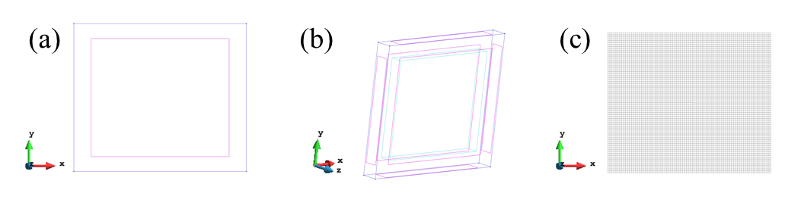
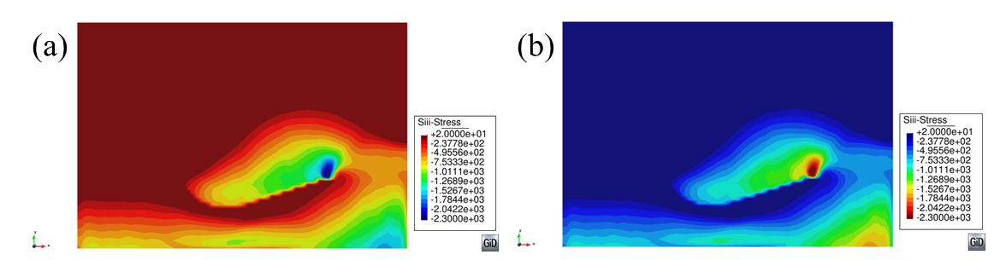
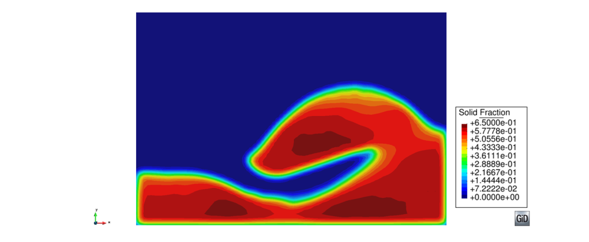

#Tutorial 4: Soil excavation

*Author: Alvaro Janda*

##Introduction

This tutorial describes the pre and post processing of the data obtained by DEM simulation
of a bucket excavator digging into a cohesive soil. The aim of using Particle-Analytics is to obtain the
stress and solid fraction fields in order to obtain relevant information for the understanding
of the loading action and soil flow during the digging process.

###Problem description

The soil specimen is composed of polydisperse spherical particles arranged in rectangular
box of dimensions 0.372 x 0.204 x 0.154053 m (Lx , Ly and Lz respectively).
The particles are confined between frictionless rigid boundaries that define the simulation space.
A description of the particles and bulk properties is shown in Table 1.

|Property                   | Value     |
|:--------------------------|:----------|
|Number of particles        | 5 x 10^5  |
|Mean particle diameter, mm | 1.5       |
|Polydispersity             | 10%       |
|Initial solid fraction     | 0.62      |

*Table 1: Particle and Bulk properties of the soil specimen*

The geometry of the bucket used for the digging process was obtained from a CAD geometry
repository [?] and its size was scaled down by a factor 10.
As it is shown in Figure 1, only a cross section of the bucket interacts with the particles.
Simple kinematics were implemented for the bucket trajectory combining translational and rotational movements
to simulate three different process: penetration, dragging and rotation. A sketch of the
bucket geometry and the kinematics is displayed in Figure 1.

The DEM simulation was conducted using EDEM 2.5 and the interaction between the
particles is defined by an Elasto-plastic frictional adhesive contact model [?].
The simulation was run for 2.41 s and the data was exported at a frequency of 10Hz.
The exported files with the information of the particles and the contacts follow the standard format
described in the Apendix A of the Particle-Analytics user manual.

*Figure 1: Sketch of the bucket geometry and the kinematics during the digging cycle.*

##Preparing analysis

In this section, how to create the geometry and mesh to visualise the results will be explained.

###Geometry creation

A rectangular box equivalent to the frictionless boundaries that confine the particles in the
DEM simulation was created. The following steps are necessary to create the rectangular box:

1. Create a rectangle: `Geometry > Create > Object > rectangle`. The software will ask for two points that correspond to two opposite corners of the rectangle. A more detailed explanation on how to create an object can be found in the help of GiD in the section “Geometry”. A snapshot of the rectangle is shown in Fig. 4 (a).
2. Extrude the surface to a volume: `Utilities > Copy`. The rectangular surface will be extrude in z direction to create the rectangular box. A snapshot of the Copy tool 2options to do this task is shown in figure 2. After settin-up the different field, click Select and with the mouse select the rectangle. Then click finish in the window of the Copy tool and the rectangular box is created. The image can be rotated using
the trackball tool to check that the box is created (see Figure 4b).

*Figure 2: Snapshot of the Copy tool where it is shown the different options to extrude the rectangle to a rectangular box.*

###Mesh generation

Once the geometry is drawn, it is necessary to create the mesh associated to it. In this
case, a Cartesian mesh composed by box elements is chosen due to the properties of the
geometry. The spacing through the three axis `(x,y,z)` is the same and equal to 0.0045 m
that is equivalent to 3 times the mean diameter of the particles. To create the cartesian
mesh go to `Mesh > Cartesian > Volume`. A window with three fields to assign the size
through each dimension will be displayed. Then, introduce the size of 0.0045 for each
dimension (see Fig. 3). Click on “Assign” and select the rectangular box created in the
previous section.

Once the size of the elements is fixed, the mesh must be generated. This is accomplished
going to `Mesh > Generate mesh`. The software will ask for the size of the mesh elements
that must be 0.0045 as explained in the previous steps. Finally, the mesh will be created
and it can be visualised clicking on `View mesh`. A snapshot of the created mesh is shown
in Figure 4c.

*Figure 3: Snapshot of the mesh cartesian window to select the size of the mesh elements through each dimension.*

*Figure 4: Snapshots of the geometries: a) Rectangle; b) Rectangular box: c) Cartesian mesh generated for rectangular box.*

##Analysis settings

In this section it will be explained how to setup the different parameter for the analysis
with Particle-Analytics. The preferences for the analysis can setup at the button named “CG preferences” that is located just below Particle-Analytics symbol.
A window like the one shown in Figure 5 will appear.
Problem data window has five different sections named : Input, Time Averaging, Spatial Averaging, Output and Advanced.
The preferences used in this tutorial for each field are the following.

**Input**

- `FILENAME`: Browse to the destination of dump.p3p and select.
- `READ CONTACTS`: YES (this option is activated to use the information of the contact in the analysis)
- `READING TIME STEPS`: ALL
- `STEP FREQUENCY`: 1
- `FIXED PARTICLE SYSTEM`: Not activated
- `FILTERING ID`: Not activated

**Time Averaging**

- `USE TIME AVERAGE`: Not activated (In this case temporal averaging was not performed).

**Spatial Averaging**

- `TYPE` : Coarse Graining
- `FUNCTION TYPE` : Gaussian
- `WIDTH` : 0.0045 (equivalent to 3 times the diameter of the particles)
- `CUTOFF` : 3.0
- `SPATIAL INTEGRAL` : 1D
- `INTEGRATION DIRECTION 1D` : Z (Integration is set-up in the perpendicular direction to the symmetry planes of the process)
- `CALCULATE GRADIENTS` : Not activated

**Output**

- `FILE TYPE` : `GID BINARY` (ASCII or Binary format can be chosen according to the need)
- `OUTPUT FILE` : OTHER
- `OUTPUT FILENAME` : Browse to the directory to save the output file and assign a name
- `SCALE RESULTS` : YES (Scale factor combined with the Spatial Integral is used to compute the mean values of the results along Z direction)
- `SCALE VALUE` : 25.1889 (This value corresponds to the inverse of the length of the simulation box in Z direction 1/L z )
- `PRINT PARTICLES` : Activated
- `PRINT PARTICLE CONTACTS` : Activated
- `PRINT SYMMETRIC STRESS` : Activated
- `PRINT PRESSURE` : Activated

**Advanced**

- `OVERWRITE PARTICLE VARIABLES` : Not activated
- `GROUPS FILENAME` : not used to this tutorial

##Visualizing results

After finishing the Particle-Analytics analysis a the software displays a window and click on post process button.
This will change Gid to postprocess version to visualise the results.
First, load the file from the Particle-Analytics post processing tool bar. This will load the results of the Coarse graining process.

### Figures

The results can be visualised creating different type of figures. In this tutorial Contour
fill figures will be created to visualise the major principal stress and solid fraction fields.
These can be achieved by going to `View Results > Contour Fill > Stress  > S_iii - Stress` and
`View Results > Contour Fill > Solid Fraction`.
In Figure 6a is shown the contour fill figure of major principal stress (S_iii - Stress) for a time step of the simulations.
Once the figure is created, some visualisation preference can be defined as following:

- Define maximum and minimum value for the variable. This action will fix the range of the colobar for all time steps.
  – Maximum value: `Options > Contour > Max options > Set value`. Introduce the maximum value (20 Pa for this tutorial).
  – Minimum value: `Options > Contour > Min options > Set value`. Introduce the minimum value (-2300 Pa for this tutorial).

- Define the color for values out of the range defined in the previous step.
  - Maximum value: `Options > Contour > Max options > Out of MaxColor > Max Color`.
  – Minimum value: `Options > Contour > Max options > Out of MaxColor > Min Color`.

- Define the color scale (Default option is Standard: Max=red and Min=blue). In this tutorial the color scale for the stress is chosen and the inverse of the standard one.
  – Inverse Standard: `Options > Contour > Color scale > Inverse Standard` (the result is shown in Figure 6b).

*Figure 6: Major principal stress field for a single time-step: a) Standard color scale; b) Inverse Standard color scale.*

Similar procedure can be followed to visualise the solid fraction filed that is shown in Figure 7.
In this case, standard scale color is chosen and Max and Min values are 0.65 and 0 respectively.

*Figure 7: Solid fraction field for a single time-step using standard color scale.*

###Images and Videos

The figures created each time step can be exported as Image files or video files. This can be
done using the Animations tool at the Particle-Analytics toolbar (see section 4.4 of the Particle-Analytics user manual).
In this tutorial the figures are exported as image files in png format. After clicking on the
Animations tool, the “Animate” tool window is opened. Go to “Save image” and activate
the “Save” button. Chose a header name and a directory to save the image files. Then,
click on `Play` button and automatically the images will be created and saved on the
previously defined path directory.
An example of the images for different simulation steps is shown in Figure 8.

*Figure 8: Figures of the results for different time steps of the simulations. Left) Particles and bucket (obtained by EDEM). Center) Major principal stress. Right) Solid fraction.*

